- [Introduction](#introduction)
- [B2B Commerce](#b2b-commerce)
  - [Cache](#cache)
- [B2C Commerce](#b2c-commerce)
  - [Eclipse UX Studio](#eclipse-ux-studio)
  - [MVC structure](#mvc-structure)
    - [View Layer](#view-layer)
    - [Controller Layer](#controller-layer)
    - [Data Model Layer](#data-model-layer)
  - [Storefront Reference Architecture (SFRA)](#storefront-reference-architecture-sfra)
  - [Salesforce Connector](#salesforce-connector)
  - [Extensions for VS Code](#extensions-for-vs-code)
- [Courses](#courses)

# Introduction

- What are Options for building cloud base ecommerce websites with Salesforce?
- Leading practices around designing and building ecommerce websites on Salesforce
- Application lifecycle management on Salesforce

> Salesforce bought DemandWare for B2C commerce (rebranded as SFCC Salesforce commerce cloud)

> Salesforce bought CloudCraze for B2B commerce (native Salesforce app, in it's own domain)

# B2B Commerce

> native app built on Salesforce platform which is installed from app exchange

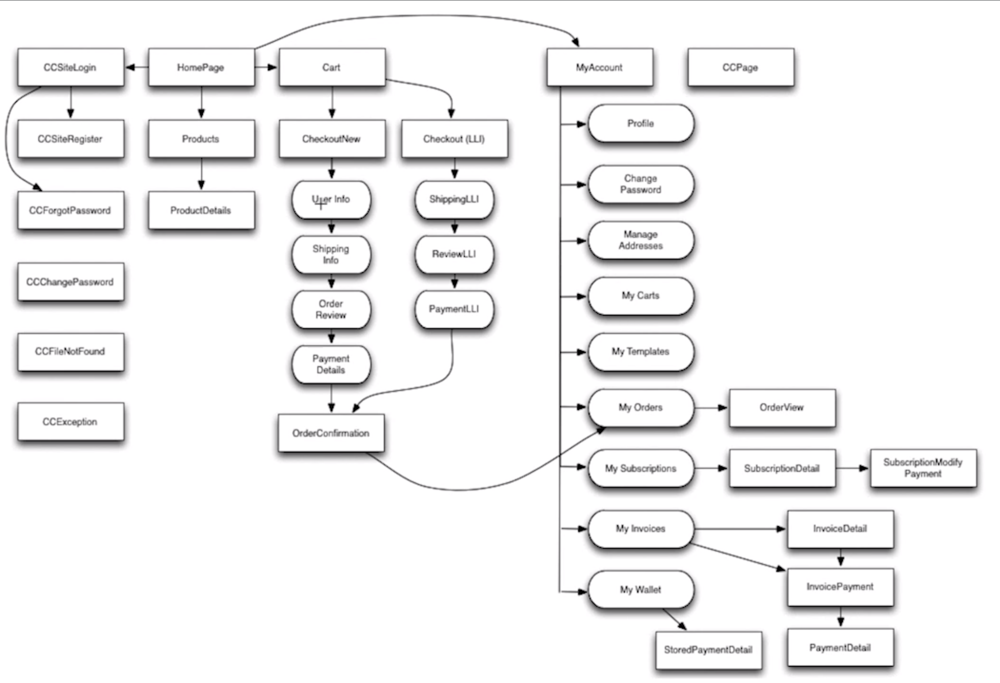

products available by customizable rules like:

- geography
- bundle

## Cache

granular options (specific) depending on the changes

> think about what you want to cache, it's better to cache everything than nothing as
> it impacts the site critically

> most of the setup can be done thru the UI (declaratively), but you can also do stuff programmatically

# B2C Commerce

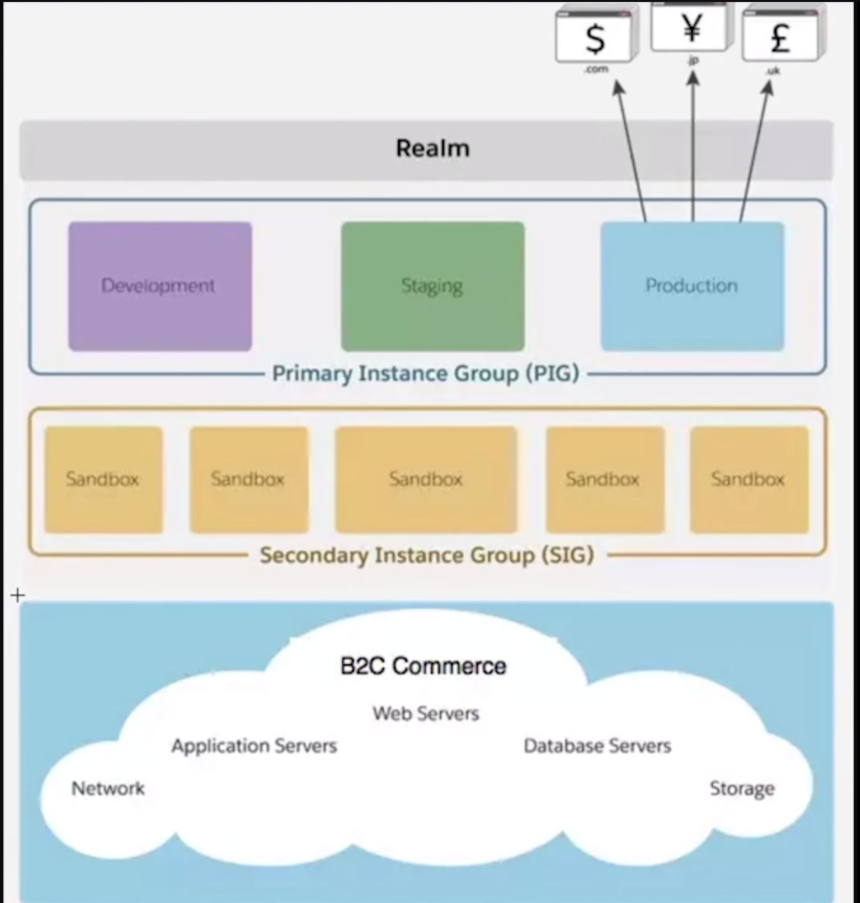

Point of Delivery (POD) - data centers around world, equivalent of instance in the Salesforce

Realm - equivalent of Salesforce org, within Realm multiple ecommerce sites

each ecommerce site will have:

- a Primary Instance Group (PIG)
- a Secondary Instance Group (SIG)

> Only difference between PIG and SIG is the power of the machines (storage, CPU etc.)

last there's an Infrastructure Layer (storage, network etc.)

## Eclipse UX Studio

> Visual Studio is becoming the major IDE for Salesforce development

[Install and Configure UX Studio](https://trailhead.salesforce.com/en/content/learn/modules/b2c-developer-resources-and-tools/b2c-developer-install-and-configure-ide)

> Start up Eclipse and use the "Install New Software" link under the Help menu. Paste the URL in the "Work with" entry and give it a name. The rest is dialog based and only requires accepting a license agreement.

[Install or Update UX Studio](https://documentation.b2c.commercecloud.salesforce.com/DOC1/index.jsp?topic=%2Fcom.demandware.dochelp%2FSiteDevelopment%2FInstallUXStudio.html)

> For debugging / viewing pipelines we still have to use Eclipse and demandware plugin

> Digital Development perspective in Eclipse means you installed UX Studio

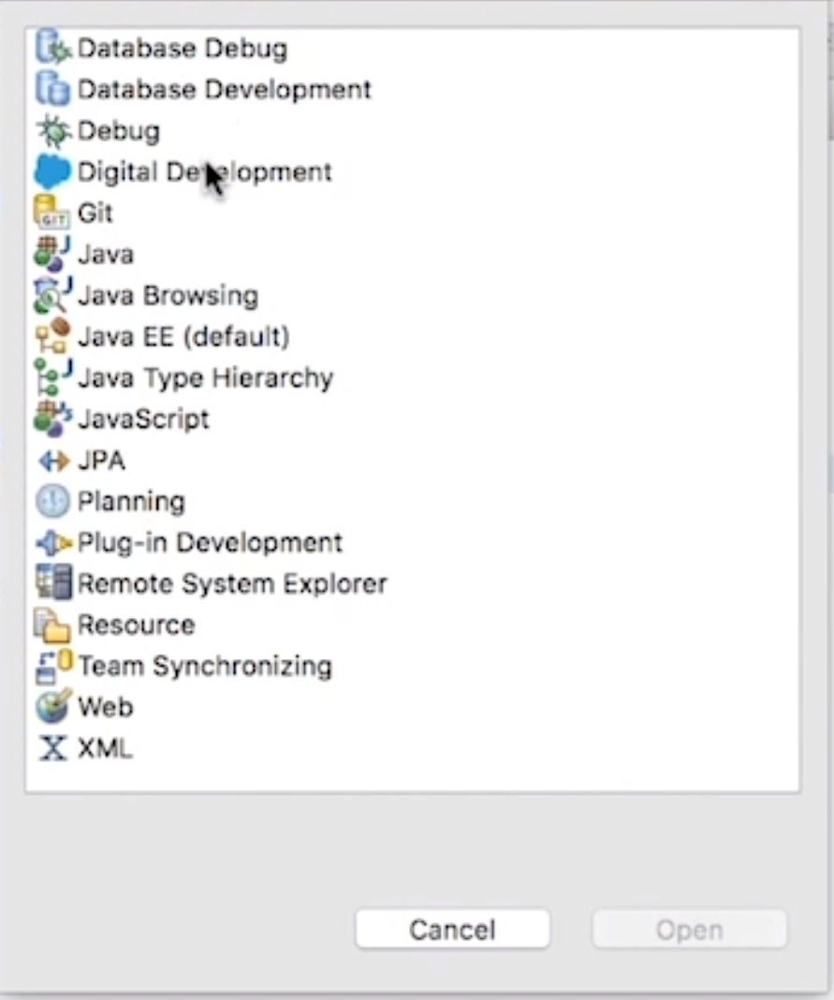

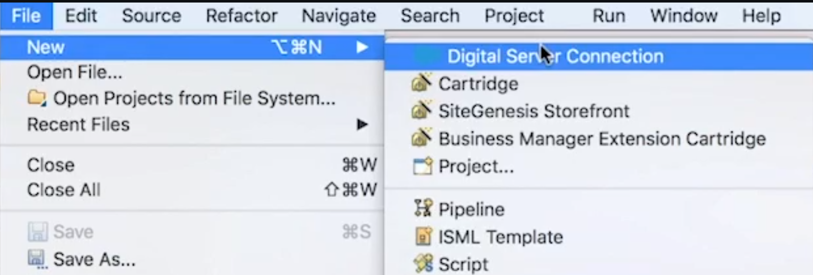

> API definitions are updated on the monthly basis

> Cartridge - building block of a site

Attaching the Cartridge to a Digital Server will push it to the sandbox (auto-upload of code to the sandbox).

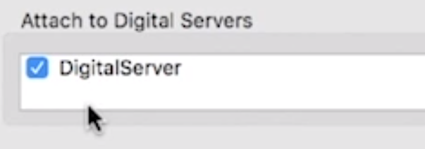

> Merchant is responsible for content and the way the site functions - higher level

> Administration tab - useful for devs/admins, lower level, everything related to code

> SiteGenesis is a fully functioning site, it's not recommended to build your own site but use this as a starting point

> SiteGenesis is being replaced with a new architecture called Storefront Reference Architecture (SFRA)

> ISML - Internet Store Markup Language

## MVC structure

### View Layer

Storefront toolkit - floats on the page, allows quick reference to utilities

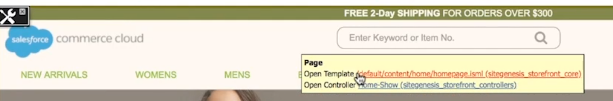

> CTRL+SHIFT+R - open file

Convention based so `Product-ShowInCategory` is a `controller-action`, `Product` is the controller, `ShowInCategory` is an action.

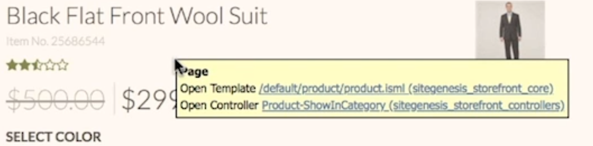

`ISML expressions`
`pdict - pipeline dictionary`
`Local Include` - static markup dumped on the page which calls it
`Remote Include` - markup used on some other page

Cache Information shows caching info for everything on the page (use Business Manager for cache control)
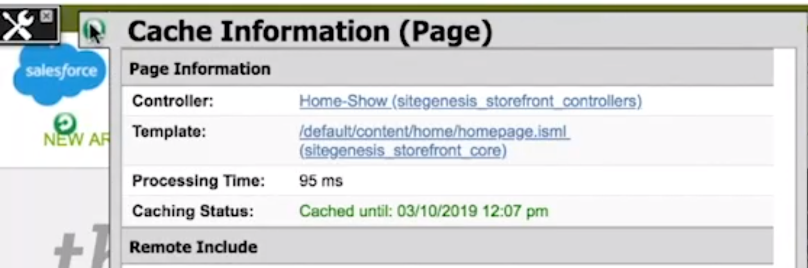)

### Controller Layer

> Written in JS, not in Pipelines

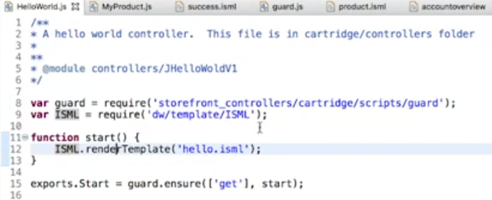

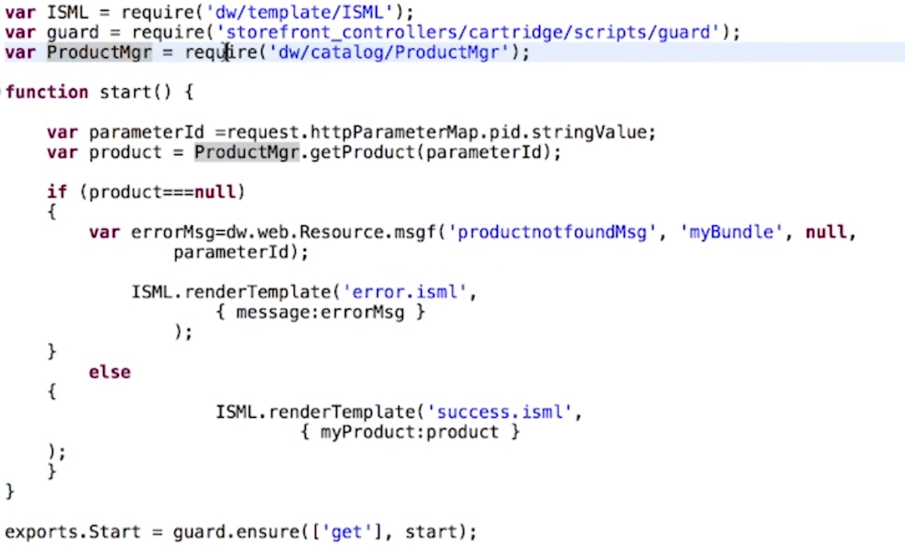

> Use Request Log from the Toolkit for debugging controllers (gives full stack overview)

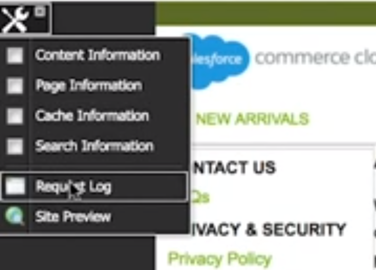

Also use Commerce Cloud Digital API for reference.

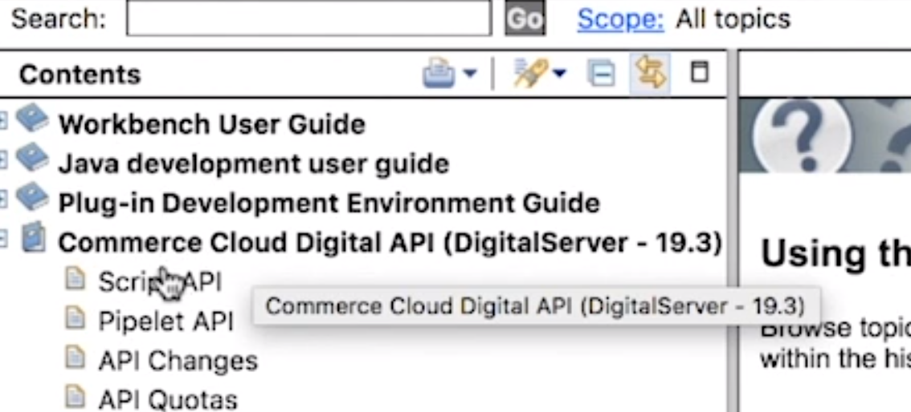

> Administration tab > Pipeline Profiler (shows the name Pipeline but used to debug the performance aspect of controllers)

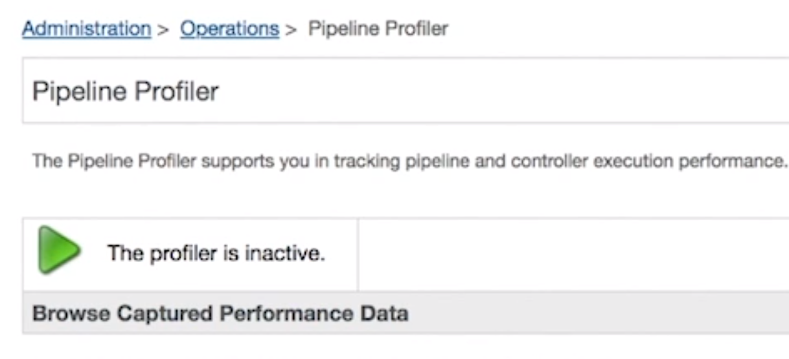

Turn it off when done as it will kill your sandbox!

### Data Model Layer

Standard Objects aka System Objects (product, catalog, price)
Custom Objects (creating instance or schema)

> Go to Administration tab > Site Development > Custom Objects Types

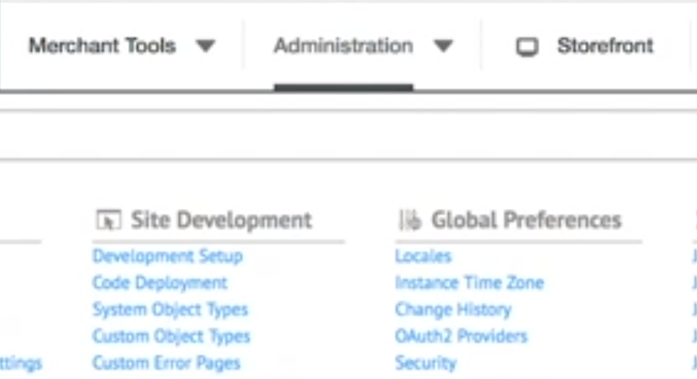

or programmatically using `CustomObjectMgr`

> Transactional data should not be stored in custom objects.

## Storefront Reference Architecture (SFRA)

Use SFRA for new sites, don't use SiteGenesis architecture.

> Not using the Lighting design system

[Get the SFRA Repositories from GitHub](https://documentation.b2c.commercecloud.salesforce.com/DOC2/index.jsp?topic=%2Fcom.demandware.dochelp%2FSFRA%2FSFRASetup.html)

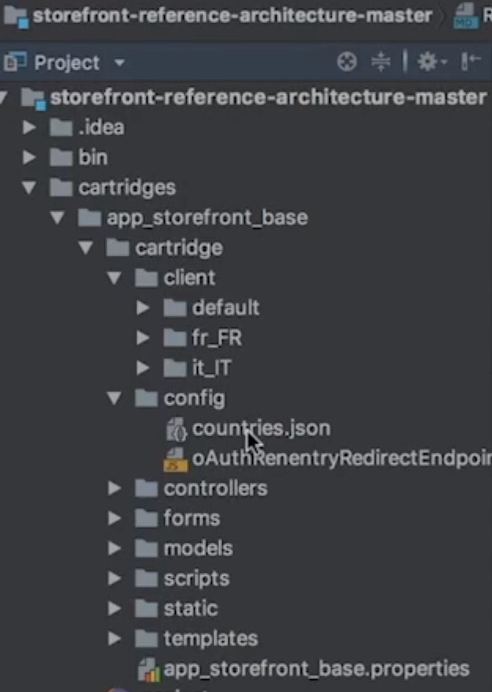

[Storefront Reference Architecture](<[https://link](https://www.salesforce.com/products/commerce-cloud/resources/commerce-cloud-storefront-reference-architecture/)>)

> Commerce Cloud Storefront Reference Architecture combines best practices in site design, merchandising, and technical architecture to provide an out-of-the-box blueprint for merchants to build sites as unique as their brands.

## Salesforce Connector

> Sync data between Commerce Cloud and Service Cloud or Marketing Cloud etc..

Custom implementation needed, only provides starting point for integration.

## Extensions for VS Code

[Salesforce Extensions for Visual Studio Code](https://developer.salesforce.com/tools/vscode/)
[Salesforce Extension Pack](https://marketplace.visualstudio.com/items?itemName=salesforce.salesforcedx-vscode)

[Visual Studio Code integration with Demandware A.K.A Salesforce Commerce Cloud](https://medium.com/@manusaini0088/visual-studio-code-integration-with-demandware-aka-salesforce-commerce-cloud-b2c2ff49e22b)

[Prophet Debugger](https://marketplace.visualstudio.com/items?itemName=SqrTT.prophet)

> A VS Code extension to work with Demandware/Salesforce Cloud code on Sandbox that support the Script Debugger API (SDAPI) 2.0

# Courses

[Pluralsight](https://www.pluralsight.com/browse/software-development/salesforce)

[Salesforce Developers](https://www.youtube.com/user/DeveloperForce/videos)
